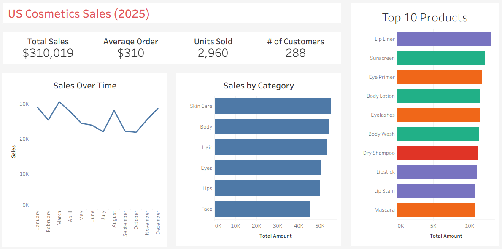
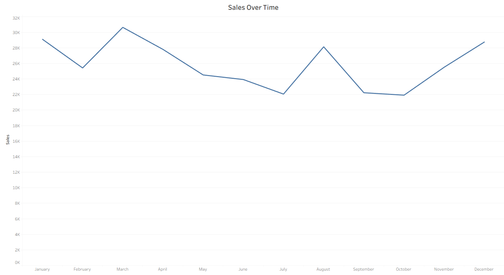
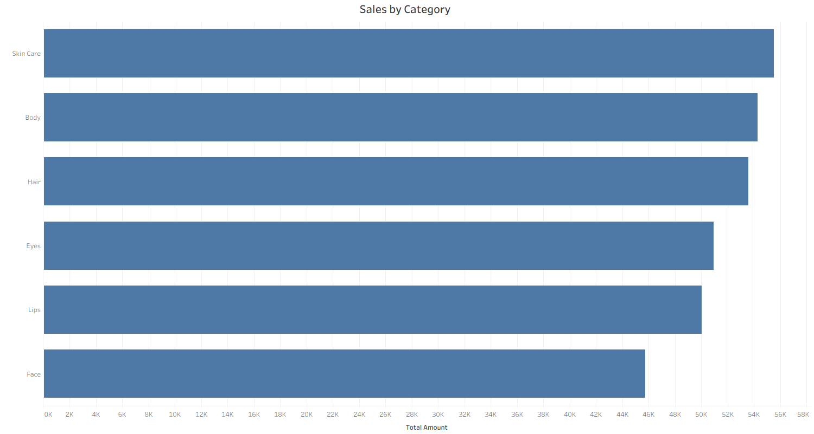
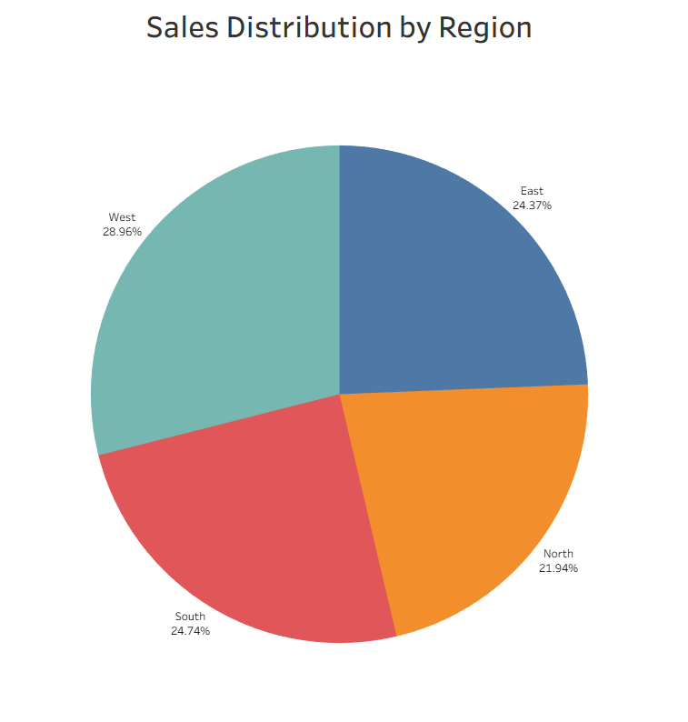
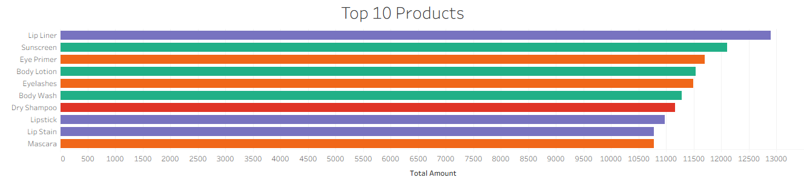

# Cosmetics Sales Analysis

## Overview
This project analyzes sales data using SQL and Tableau to identify revenue trends, customer behavior, and product performance.

## Dataset
A custom sales dataset (1000 entries) was generated using Python to simulate real-world ecommerce transactions.

## Project Workflow
1. Generated synthetic sales dataset using Python
2. Loaded data into SQL for analysis
3. Wrote queries to calculate KPIs and business insights
4. Built a Tableau dashboard to visualize results

## Tools Used
- SQL
- Tableau Public
- Python
- GitHub

## Key Metrics (KPIs)
- Total Sales
- Average Order Value
- Units Sold
- Unique Customers

## SQL Queries
- Aggregations using SUM, AVG, COUNT
- Grouping by category and date
- Filtering and business analysis

## Visualizations

### Dashboard

### Sales by Month

### Sales by Category

### Sales Distribution by Region

### Top 10 Selling Products

## Author
Lance Cox
